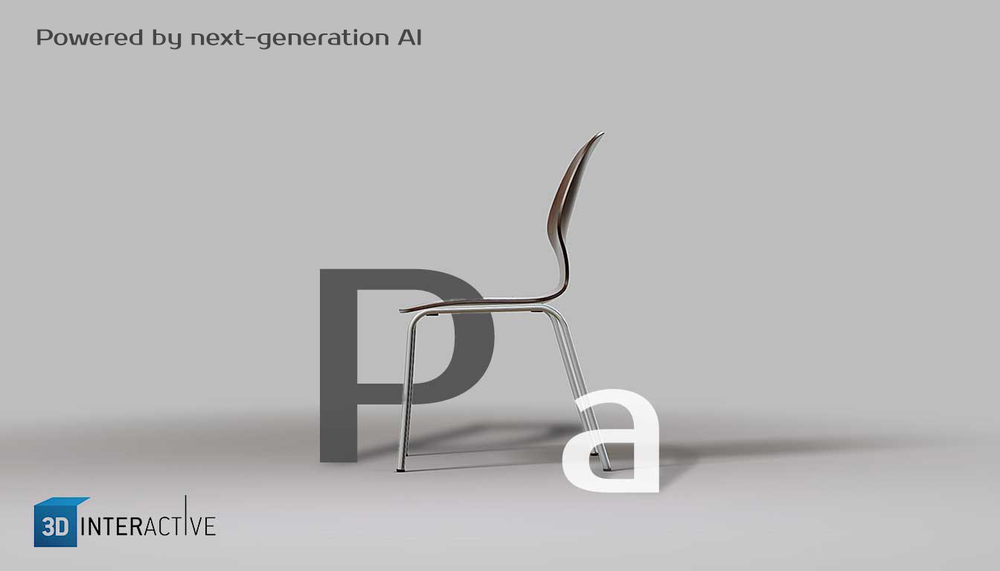
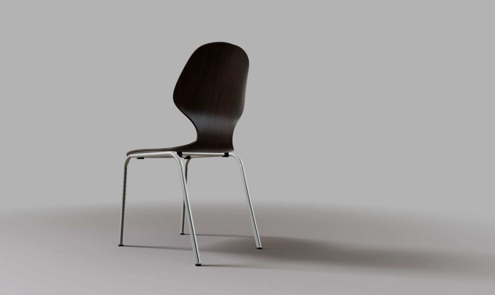
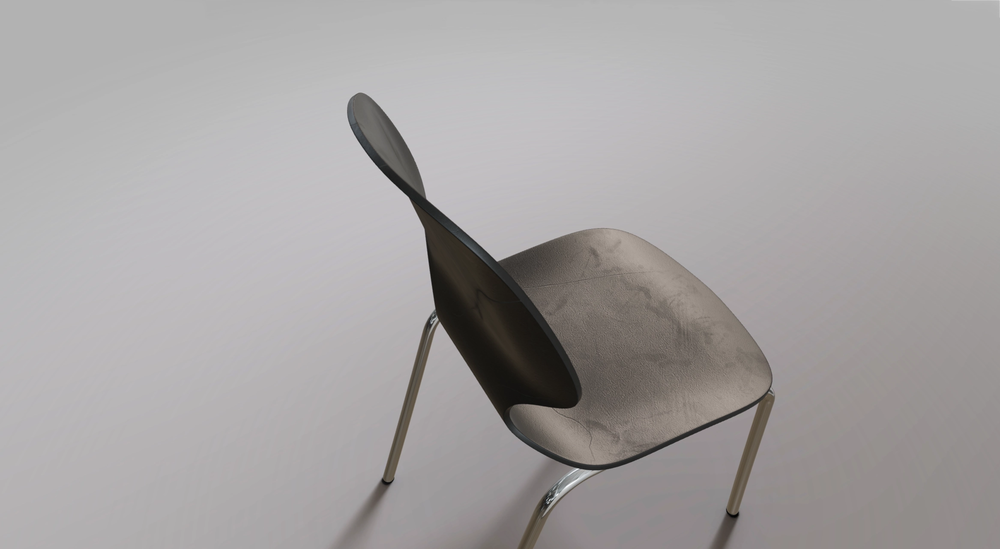
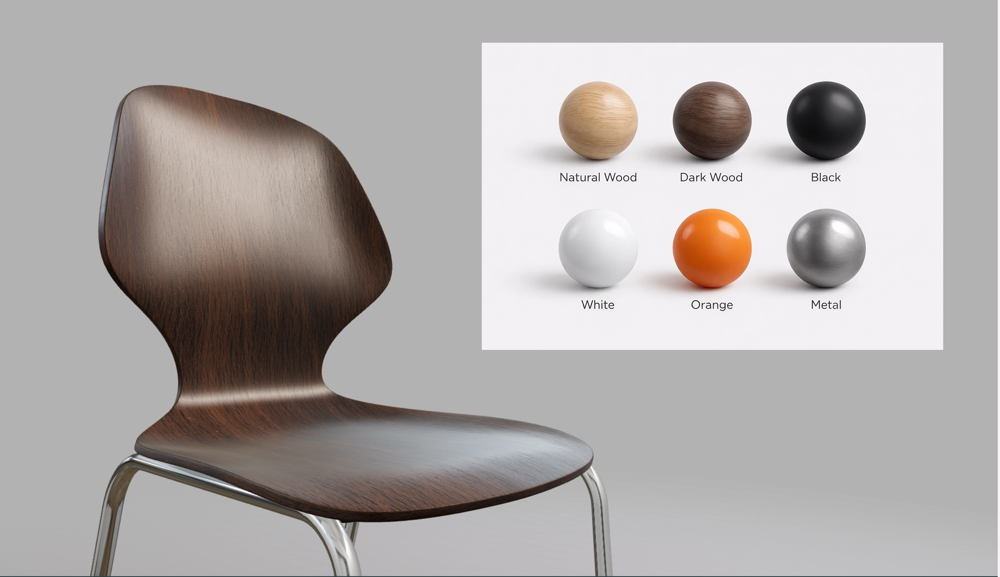
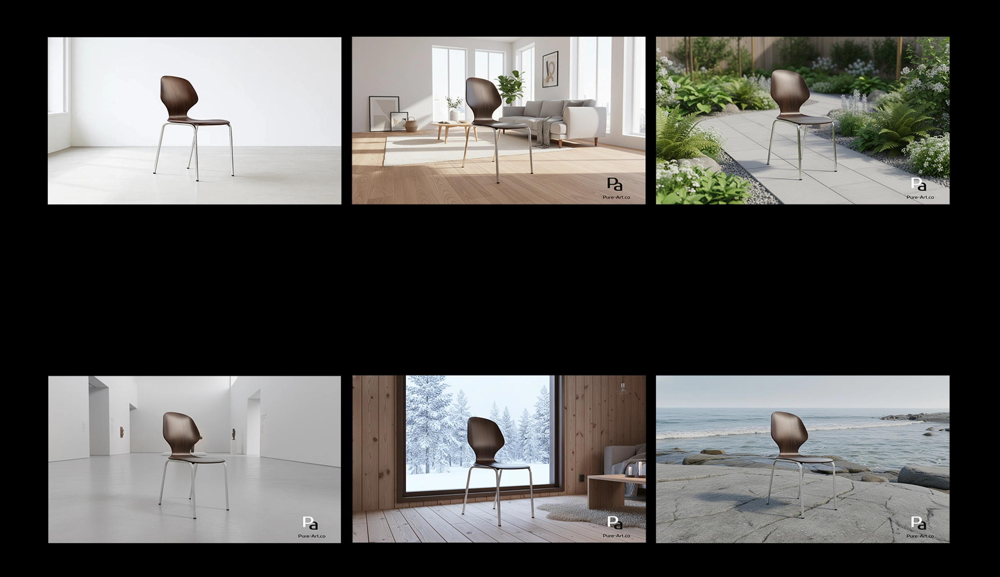
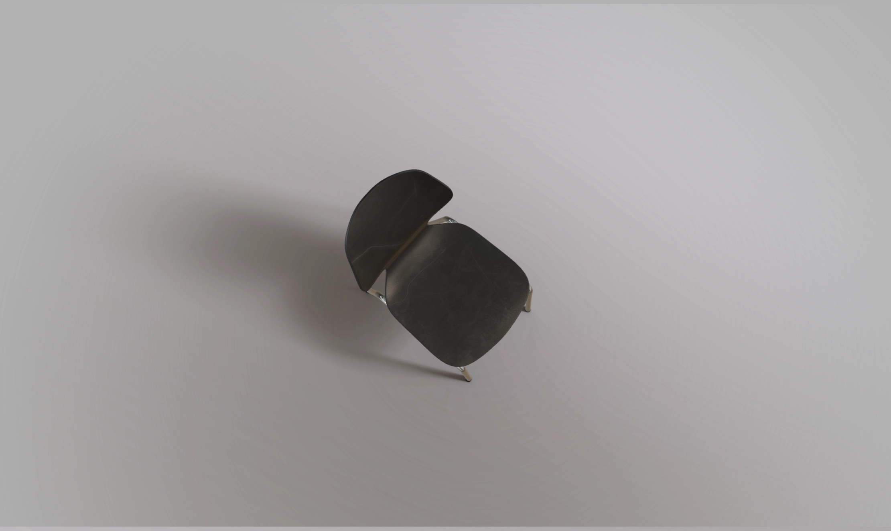
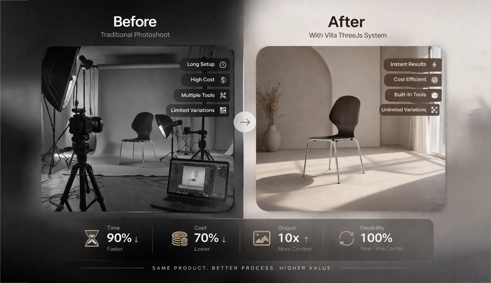

# PureNordStudio — Cinematic 3D Product Experience

🔗 Live Demo: https://purenordstudio.pure-art.co/  
📖 Full Case Study: https://pure-art.co/pages/Subpages/3d-viewer-01.html  

Cinematic real-time 3D product experience built for modern brands — combining interactive product exploration, studio tools, and AI-powered visual generation inside one browser-based system.

---

## Key Results

- Cinematic product presentation directly in the browser  
- Real-time material exploration  
- Built-in studio workflow (image & video capture)  
- AI-powered image generation from live 3D scene  
- Designed for modern product storytelling and digital marketing  

---

## Product Experience

A premium product experience that presents objects with cinematic quality instead of static images or basic viewers.

---

## Interactive Features

Users can explore materials in real time, capture visuals, and create content directly inside the browser without switching tools.

---

## AI Workflow

The system allows users to generate new AI-based product visuals directly from the live 3D scene.

This turns a single product setup into multiple creative outputs without leaving the experience.

---

## Project Overview

PureNordStudio was built to move beyond traditional product presentation.

Instead of showing products as static images or simple 3D viewers, the system creates a complete interactive experience where users can explore, customize, and generate new visuals in real time.

The goal is to bring product presentation, interaction, and content creation into one unified workflow.

---

## Core Experience

- Cinematic product introduction and camera flow  
- Real-time material switching  
- Built-in studio tools for content creation  
- AI-powered visual generation  
- Clean and modern user experience  

---

## Why It Matters

Modern product presentation is no longer just about showing an object.

It is about how clearly a product communicates its quality and how easily users can explore it.

PureNordStudio demonstrates how real-time 3D can enhance product storytelling, improve engagement, and support marketing workflows directly in the browser.

---

## Business Value

- Faster content production without external tools  
- Reduced need for repeated photoshoots  
- More control for marketing and creative teams  
- Consistent product visuals across campaigns  

---

## Outcome

A production-ready browser-based system that combines real-time 3D, interactive exploration, and AI-powered content creation into one seamless experience.

This approach transforms product presentation from a static display into an interactive and scalable digital tool.

---
